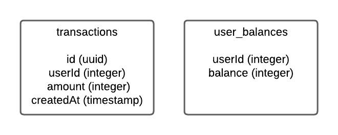

## Description
Необходимо доработать микросервис и имплементировать метод начисления/списания средств у юзера.
Баланс не должен опускаться ниже 0.
При недостатке средств должен вызываться exception с ошибкой: ```not enough balance```
При успешном действии должно возвращаться ```{ "success": true } ```

Метод хранится в файле src/transactions/transactions.service.ts -> TransactionsService -> create

Схема базы данных:



## Running the app

1. Install dependencies 
```bash
$ npm install
```

2. Run database
```bash
$ docker compose up -d
```

3. Run migrations
```bash
$ npm run run-migration
```

4. Run application in dev mode
```bash
$ npm run start:dev
```

## Test

```bash
# unit tests
$ npm run test

# e2e tests
$ npm run test:e2e

# test coverage
$ npm run test:cov
```
